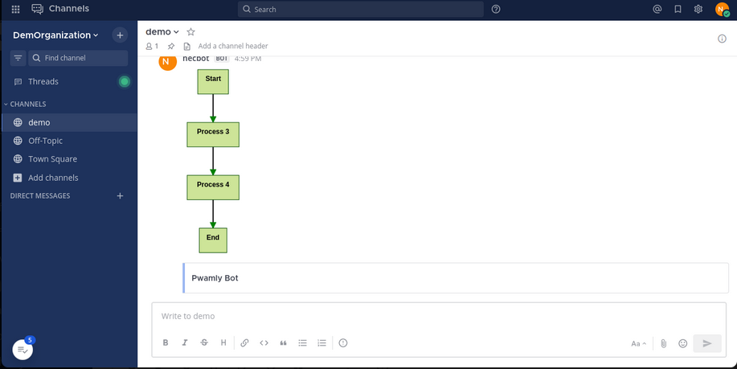

# Mermaid
  mattermost mermaidjs plugin

	This plugin expects to receive a message from outside MM with the payload of the markdown. Something like this:

	'response_type' => 'in_channel',
	'attachments' => array(array(
		'color' => getMMMsgColor('blue'),
		'title' => $q['title'],
	)),
	'props' => array('mermaidData'=>markdown here),

	we are using it from a chatbot

	the chartjs plugin is the same:

	'response_type' => 'in_channel',
	'attachments' => array(array(
		'color' => getMMMsgColor('blue'),
		'title' => $q['title'],
	)),
	'props' => array('chartdata'=>chartjs data here)),

    we are doing this from [coreBOS](https://github.com/tsolucio/corebos) with [this extension](https://github.com/tsolucio/chatwithme)
 

# ALSO
This plugin allows you to integrate external services with your Mattermost instance using incoming webhooks.

## Installation

To get started with this plugin, please follow these steps:

1. In your Mattermost instance, go to the **Product** menu, and select **Integrations** > **Incoming Webhook**.

   If you don't see the **Integrations** option, incoming webhooks may not be enabled on your Mattermost server or may be disabled for non-admins. They can be enabled by a System Admin from **System Console** > **Integrations** > **Integration Management**.

2. Select **Add Incoming Webhook** and provide a name and description for the webhook. The description can be up to 500 characters.

3. Choose the channel where you want to receive webhook payloads, then click **Add** to create the webhook. This action will generate a unique webhook endpoint URL.

   **Note:** Treat this endpoint as a secret. Anyone who has it will be able to post messages to your Mattermost instance.

## Testing the Plugin

To test the plugin, you'll need to send a payload to the webhook endpoint you created in the previous step. You can use HTTP POST requests to do this. Here's how:

1. Use the obtained webhook endpoint URL, which should look something like this: `https://your-mattermost-server.com/hooks/xxx-generatedkey-xxx`.

2. Send an HTTP POST request to the webhook endpoint with the payload. Below is an example of a sample payload sent from Postman:

   ```json
  {
  "response_type": "in_channel",
  "attachments": [
    {
      "color": "red",
      "title": "Demo Bot"
    }
  ],
  "props": {
    "mermaidData": "graph TD;\n  A[Start] --> B[Process 3];\n  B --> C[Process 4];\n  C --> D[End];"
  }
}

   
## ScreenShots


